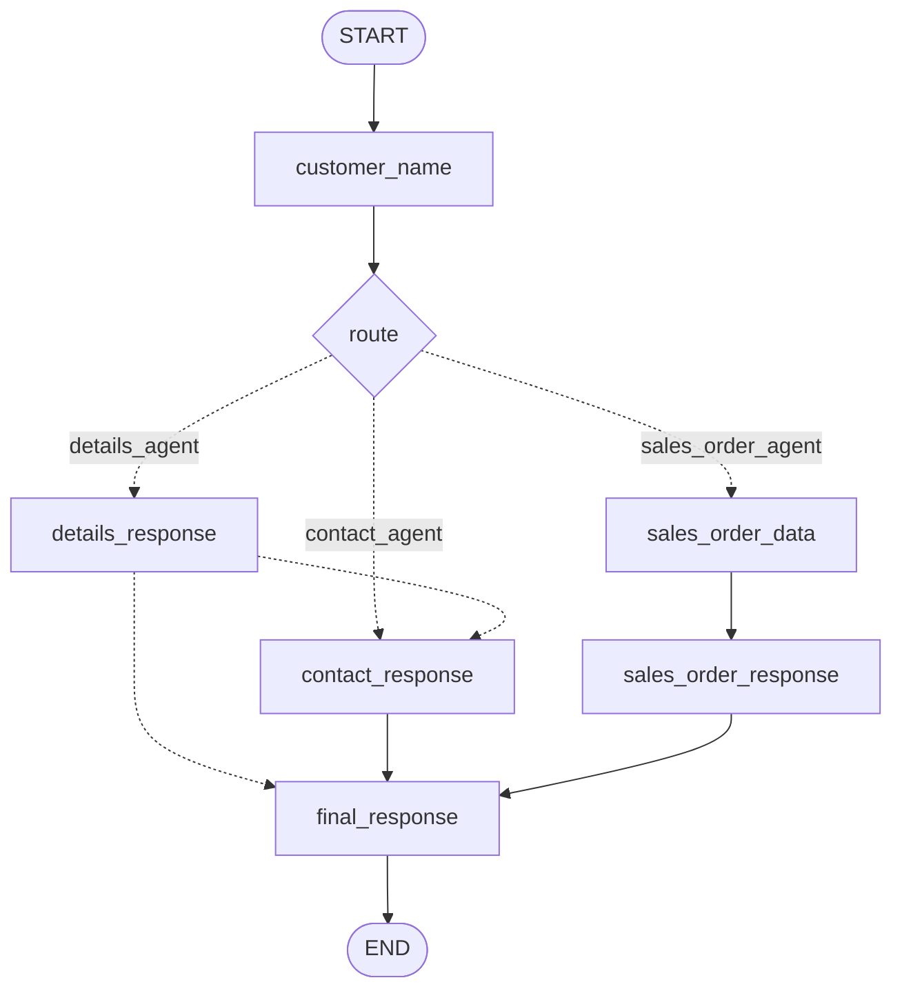

# AI ERPNext Business Assistant

An AI-powered business assistant that connects with ERPNext to answer customer-related questions and retrieve sales order information using LLMs, LangGraph workflows, and specialized agents.

The project explores how to build reliable AI applications through structured workflows, reflection, iterative feedback, multi-agent routing, and ERPNext API integration.

## Overview

The AI ERPNext Business Assistant supports customer and sales order queries through a conversational interface.

The project has evolved through three stages:

- **Reflection:** Analyzes retrieved sales order data and reviews the generated answer.
- **Reflexion:** Uses feedback and lessons from previous attempts to improve an answer through an iterative workflow.
- **Multi-Agent System:** Routes user requests to specialized agents for customer details, contact information, or sales order queries.

The application uses ERPNext as its business data source and a locally running LLM for language processing.

## Application Demo

The screenshot below shows the application running in Gradio.


> Replace `data/your-screenshot-filename.png` with the actual path to your screenshot. Keep the screenshot committed to the repository so it appears on GitHub.

## Architecture

The project uses different LangGraph workflows to demonstrate increasingly capable AI application patterns.

### 1. Reflection Workflow

The Reflection workflow retrieves sales orders for a customer, analyzes the results, and reviews the generated analysis.

Main flow:

1. Retrieve sales orders from ERPNext.
2. Analyze the retrieved data.
3. Review the generated analysis.
4. Return the response.

The goal is to check the quality and completeness of an answer before returning it.

### 2. Reflexion Workflow

The Reflexion workflow extends Reflection by introducing feedback, lessons, and retries.

Main flow:

1. Retrieve sales order data.
2. Generate an analysis.
3. Evaluate the analysis.
4. If improvements are required, generate feedback.
5. Extract a lesson from the previous attempt.
6. Retry the analysis using the available feedback and previous-attempt information.
7. Stop when the response is approved or the maximum iteration limit is reached.

This workflow demonstrates how a graph can use state, conditional edges, and iterative execution to improve an answer.

### 3. Multi-Agent Workflow

The Multi-Agent workflow routes user requests to the appropriate processing path.



#### Workflow components

| Component | Responsibility |
|---|---|
| `customer_name` | Identifies the customer referenced in the user's query. |
| `route` | Determines which processing path should handle the request. |
| `details_response` | Retrieves and prepares customer details. |
| `contact_response` | Retrieves and prepares customer contact information. |
| `sales_order_data` | Retrieves sales order data from ERPNext. |
| `sales_order_response` | Processes the retrieved sales order information into a response. |
| `final_response` | Produces the final response for the selected processing path. |

The customer details path can continue to the contact response when contact information is also required. The sales order path retrieves the relevant orders and passes the result to the sales order response node before reaching the final response.

## Specialized Agents

### Customer Supervisor Agent

The supervisor interprets the user's query and determines which customer-related processing path is appropriate.

It supports routing for customer details, contact information, and sales order requests.

### Customer Details Agent

The Customer Details Agent handles customer information retrieved from ERPNext, such as:

- Customer name
- Customer group
- Territory
- Customer type

Unavailable fields are represented clearly rather than being treated as populated values.

### Customer Contact Agent

The Customer Contact Agent handles customer contact information, including available fields such as:

- Mobile number
- Email address

Missing contact information is identified as unavailable or not provided.

### Sales Order Agent

The Sales Order Agent retrieves sales orders for a specified customer and supports filtering by sales order status.

Supported status filters include:

- Draft
- To Deliver
- To Deliver and Bill
- To Bill
- Completed
- Cancelled
- Closed

If the user does not specify a status, the agent retrieves the customer's sales orders without applying a status filter.

The agent separates status extraction from ERPNext data retrieval so that the requested status can be used when fetching the relevant orders.

## ERPNext Integration

The application uses ERPNext REST APIs to retrieve business data.

The integration is organized into service modules for different resources, including:

- Customers
- Contacts
- Sales orders

This separation keeps ERPNext API calls outside the agent's language-processing logic and makes the application easier to test and maintain.

## State Management and Routing

LangGraph manages workflow execution and passes information between nodes through shared state.

The Multi-Agent workflow uses routing decisions to select the appropriate processing path. Retrieved data is passed through the graph to the response-generation nodes.

This structure helps separate:

- User query interpretation
- Routing decisions
- ERPNext data retrieval
- Response preparation
- Final response generation

## Validation and Testing

The project includes validation of agent behavior and workflow execution.

Completed validation includes:

- Customer name extraction
- Customer details and contact processing
- Routing to the appropriate agent
- Sales order retrieval for a customer
- Filtering sales orders by status
- Retrieving all customer sales orders when no status is specified
- Passing sales order data through the Multi-Agent workflow
- Validating state updates and final response generation across the workflow

Example sales order queries:

- Show me Sandeep's Draft orders.
- Show me Sandeep's Completed orders.
- Show me Sandeep's orders to deliver.
- Show me Sandeep's Cancelled orders.
- Show me Sandeep's To Deliver and Bill orders.
- Show me all sales orders for Sandeep.

## LangSmith Observability

LangSmith is used for tracing and inspecting LangChain/LangGraph execution.

Tracing helps inspect workflow behavior, including:

- Node execution
- LLM calls
- Intermediate outputs
- Workflow errors
- The flow of information between steps

This supports debugging and understanding how the application processes a request.

## Technology Stack

| Technology | Purpose |
|---|---|
| Python | Application logic |
| ERPNext REST API | Business data retrieval |
| FastAPI | API development |
| LangChain | LLM integration and prompt management |
| LangGraph | Stateful workflows and conditional routing |
| Ollama | Local LLM execution |
| Qwen2.5 3B | Local language model |
| Gradio | Interactive application interface |
| LangSmith | Tracing and observability |
| Git and GitHub | Version control and project hosting |

## Project Structure

```text
## Project Structure

```text
ai-erpnext-assistant/
├── app/
│   ├── agents/
│   │   ├── analyzer.py
│   │   ├── reflector.py
│   │   ├── feedback.py
│   │   ├── lesson.py
│   │   ├── customer_supervisor.py
│   │   ├── customer_details_agent.py
│   │   ├── customer_contact_agent.py
│   │   └── sales_order_agent.py
│   ├── api/
│   │   └── routes.py
│   ├── erpnext/
│   │   ├── client.py
│   │   ├── customer.py
│   │   ├── contact.py
│   │   └── sales_order.py
│   ├── graph/
│   │   ├── state.py
│   │   ├── nodes.py
│   │   ├── edges.py
│   │   ├── prompts.py
│   │   ├── workflow.py
│   │   └── workflow_multi.py
│   ├── gradio_app.py
│   └── multi_agent_gradio_app.py
├── data/
│   ├── config.py
│   └── item.py
├── debug/
│   ├── debug_graph.py
│   ├── reflexion_debug.txt
│   ├── state_debug.txt
│   └── test.py
├── tests/
│   ├── test_analyzer.py
│   ├── test_client.py
│   ├── test_contact.py
│   ├── test_contact_agent.py
│   ├── test_customer.py
│   ├── test_customer_agent.py
│   ├── test_edges.py
│   ├── test_nodes.py
│   ├── test_reflector.py
│   ├── test_reflexion_debug.py
│   ├── test_sales_order.py
│   ├── test_sales_order_agent.py
│   ├── test_supervisor.py
│   └── test_workflow.py
├── main.py
├── pytest.ini
├── requirements.txt
└── README.md
```

### Directory Overview

- **`app/agents/`** — Contains the Reflection and Reflexion components, customer agents, supervisor, and Sales Order Agent.
- **`app/api/`** — Contains API route definitions.
- **`app/erpnext/`** — Handles ERPNext API communication and customer, contact, and sales order data retrieval.
- **`app/graph/`** — Defines graph state, nodes, prompts, routing logic, and workflows.
- **`app/data/`** — Not used; application configuration and supporting data are currently under the top-level `data/` directory.
- **`data/`** — Contains application configuration and supporting data files.
- **`debug/`** — Contains scripts and text files used during debugging and workflow development.
- **`tests/`** — Contains tests for ERPNext services, agents, graph components, and workflows.
- **`main.py`** — Main application entry point.
- **`pytest.ini`** — Pytest configuration.
- **`requirements.txt`** — Python dependencies.
```

*Note: This tree reflects the known project structure. Keep any additional files that exist in your actual repository, including agent modules and test files.*

## Getting Started

### Prerequisites

- Python 3.12 or a compatible version
- ERPNext instance with API access
- Ollama installed locally
- Git

### 1. Clone the repository

```bash
git clone https://github.com/pardeepai/ai-erpnext-assistant.git
cd ai-erpnext-assistant
```

### 2. Create and activate a virtual environment

On Linux or WSL:

```bash
python3 -m venv .venv
source .venv/bin/activate
```

### 3. Install dependencies

```bash
pip install -r requirements.txt
```

### 4. Configure Ollama

Ensure Ollama is running and pull the model used by the project:

```bash
ollama pull qwen2.5:3b
```

### 5. Configure ERPNext credentials

Configure the ERPNext base URL and API credentials using the environment-variable names expected by your application.

Keep credentials in a local `.env` file or another secure configuration mechanism. Do not commit API keys, passwords, or other secrets to GitHub.

### 6. Run the application

Launch the entry point corresponding to the workflow you want to test. For example, if `multi_agent_gradio_app.py` is configured as the Multi-Agent Gradio entry point:

```bash
python multi_agent_gradio_app.py
```

Follow the local URL displayed by Gradio to interact with the application.

*Use the entry point and environment-variable names defined in your current code.*

## Design Principles

The project follows these principles:

- **Separation of concerns:** Keep API retrieval, agent logic, graph orchestration, and interface code separate.
- **Explicit workflow control:** Use LangGraph state and routing rather than relying on an unstructured sequence of LLM calls.
- **Local-first LLM execution:** Use Ollama for local inference.
- **Traceability:** Use tracing tools to inspect execution and debug issues.
- **Iterative improvement:** Apply feedback and lessons in the Reflexion workflow.
- **Validation:** Test data retrieval, filtering, routing, and state propagation.
- **Honest AI behavior:** Represent unavailable business data clearly rather than inventing missing values.

## Current Implementation Status

### Reflection and Reflexion

- [x] ERPNext sales order retrieval
- [x] Sales order analysis
- [x] Reflection workflow
- [x] Reflexion feedback and lesson loop
- [x] Conditional routing and retry handling
- [x] Maximum iteration handling
- [x] Validation of approval and retry behavior

### Multi-Agent System

- [x] Customer name extraction
- [x] Customer Supervisor Agent
- [x] Customer Details Agent
- [x] Customer Contact Agent
- [x] Sales Order Agent
- [x] Customer details and contact routing
- [x] Sales order retrieval and status filtering
- [x] Handling requests without a status filter
- [x] Integration of the Sales Order Agent into the complete Multi-Agent workflow
- [x] End-to-end validation of routing, state updates, and final responses

## Project Goals

This project is a hands-on exploration of building AI applications that interact with real business systems.

It demonstrates practical experience with:

- LLM-powered business assistants
- ERPNext API integration
- Prompt engineering
- Reflection and Reflexion patterns
- Multi-Agent workflow orchestration
- Stateful graph execution
- Conditional routing
- LLM observability and debugging
- Testing and validating AI application behavior

The long-term goal is to develop AI systems that are useful, traceable, and reliable when working with enterprise business data.